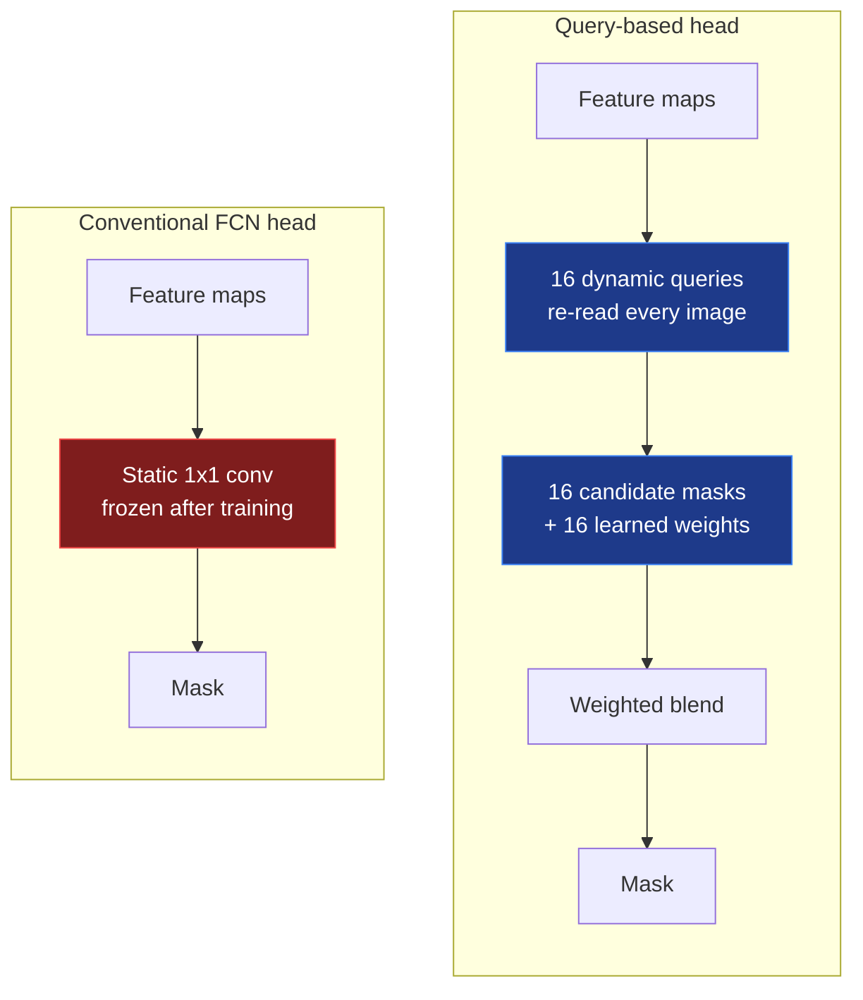
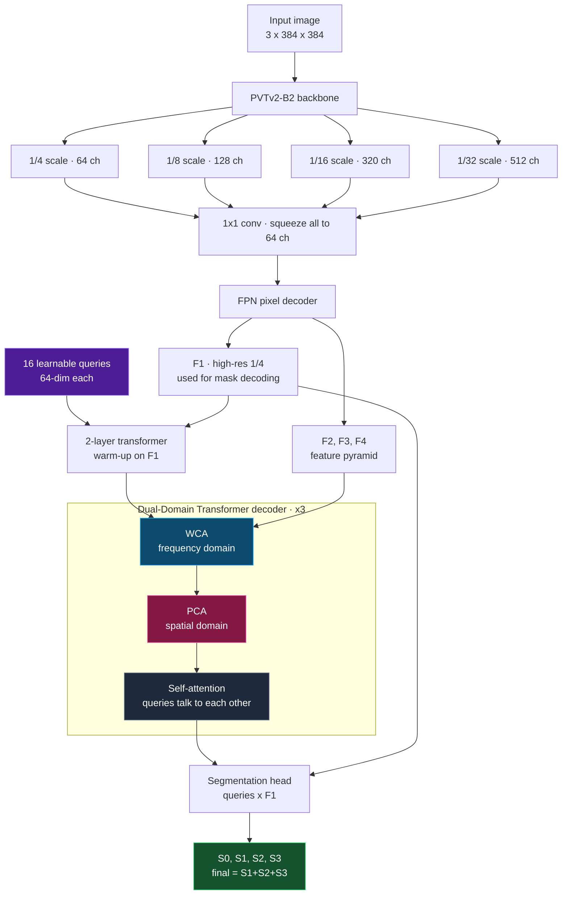
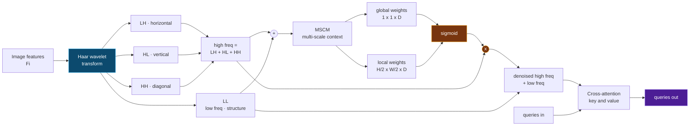
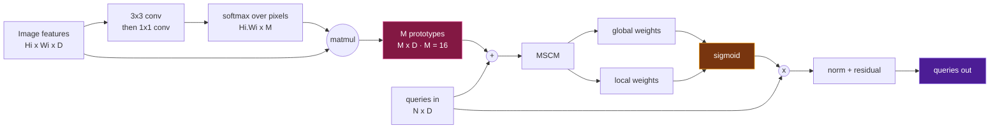
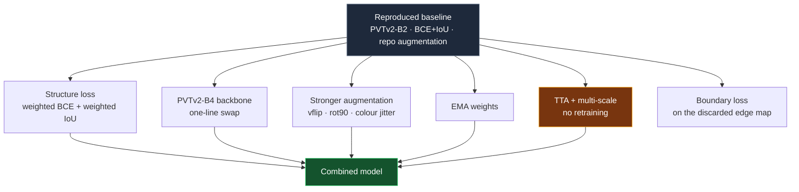

<div align="center">


<br>

**Reproducing and improving [WPFormer](https://openaccess.thecvf.com/content/CVPR2025/papers/Yan_Wavelet_and_Prototype_Augmented_Query-based_Transformer_for_Pixel-level_Surface_Defect_CVPR_2025_paper.pdf) (CVPR 2025) for pixel-level surface defect detection on CrackSeg9k**

<br>

[](https://openaccess.thecvf.com/content/CVPR2025/papers/Yan_Wavelet_and_Prototype_Augmented_Query-based_Transformer_for_Pixel-level_Surface_Defect_CVPR_2025_paper.pdf)
[](https://github.com/fengyan-cv/WPFormer)
[](https://pytorch.org/)
[](https://www.python.org/)

[](https://github.com/Dhananjay42/crackseg9k)
[]()
[]()
[]()
[-4c1?style=flat-square)]()

</div>

---

## Table of Contents

- [What this project is](#what-this-project-is)
- [The problem](#the-problem)
- [How WPFormer works](#how-wpformer-works)
  - [Architecture](#architecture)
  - [WCA — Wavelet-enhanced Cross-Attention](#wca--wavelet-enhanced-cross-attention)
  - [PCA — Prototype-guided Cross-Attention](#pca--prototype-guided-cross-attention)
- [Published results](#published-results)
- [Our contribution](#our-contribution)
- [Results](#results)
- [Quick start](#quick-start)
- [Repository structure](#repository-structure)
- [Experiment protocol](#experiment-protocol)
- [Team](#team)
- [Attribution](#attribution)

---

## What this project is

A course project in Computer Vision and Deep Learning with two goals:

1. **Reproduce** the published CVPR 2025 baseline faithfully, so the measurements can be trusted.
2. **Improve** pixel-level accuracy by 2–3% over *our own reproduced baseline* on a frozen CrackSeg9k split, through a small set of well-motivated changes — each one measured in isolation.

> **On honesty of measurement.** Every improvement is compared against a baseline we ran ourselves on the same hardware, the same library versions and the same data split — never against the number printed in the paper. That removes every argument about GPUs and dependency drift, because both sides of the comparison came off the same machine.

**This repository contains no code copied from the original authors.** The training and evaluation scripts here are original work; the authors' repository is cloned at runtime, pinned to commit [`83a33bb`](https://github.com/fengyan-cv/WPFormer/commit/83a33bbf5ed96dff069e9d58f5f3e0c464bae446), and imported unmodified.

---

## The problem

Find the defective pixels on a manufactured surface — cracks, scratches, faint anomalies — and outline them exactly. Not "this photo has a crack somewhere", but *which pixels*.

Three things make it hard:

<table>
<tr>
<td width="33%" valign="top">

### Thin
A hairline crack can be **3 pixels wide** in a 384×384 image. Downsample once and it is gone.

</td>
<td width="33%" valign="top">

### Invisible
Grey crack on grey concrete. The contrast against background is often near zero.

</td>
<td width="33%" valign="top">

### Rare
**~1.4% of pixels** are defect. A model that answers "no defect" everywhere is 98.6% accurate and completely useless.

</td>
</tr>
</table>

---

## How WPFormer works

### The core idea

Conventional segmentation networks end in a **static convolution** that classifies every pixel with the same frozen filter — one rubber stamp pressed on every image, forever. The paper's argument is that this single, image-independent "query" has no semantic representation and fails exactly where defect detection is hardest.

WPFormer replaces it with **16 learnable queries** that re-read each image, form their own mask hypothesis, and get blended by learned per-query weights.



### Architecture



**"Dual-domain"** is the name's whole point: WCA looks at the image in the **frequency** domain, PCA in the **spatial** domain. Two independent viewpoints on the same features.

---

### WCA — Wavelet-enhanced Cross-Attention

**The insight.** Split any image into low frequency (blurry big shapes) and high frequency (sharp edges and fine texture). A crack is a thin sharp line, so it lives almost entirely in the **high-frequency** band. Isolate that band and faint cracks pop out.

**The catch.** High frequency also carries every speck of sensor noise and surface grain. Turning up the treble gives you crisp detail *and* tape hiss.

**The fix.** Learn a volume knob — per channel globally, and per channel per location — and use it to suppress noise before the queries ever see the band.



The Haar transform is a **classical, non-learned** signal-processing operation sitting inside a learned attention module — a neat illustration of where Computer Vision ends and Deep Learning begins.

---

### PCA — Prototype-guided Cross-Attention

**The problem.** At 1/8 resolution there are ~2,300 spatial positions, almost all background. Comparing every query against every position lets background *dilute* the attention that should be going to the few defect pixels.

**Why the obvious fix is wrong.** Mask2Former and PEM use a **mask prior** — guess where the defect is, then only look there. But if the guess misses half the crack, later layers are forbidden from looking there and that half is lost permanently. Errors get baked in.

**WPFormer's answer: summarise instead of mask.** Compress the map into 16 **prototypes** by adaptive clustering. Every pixel still contributes to some prototype, so nothing is discarded — but the queries now talk to 16 summaries instead of 2,300 noisy positions.



> Two differences from PEM, per the paper: PEM builds prototypes by *masked cross-attention* whereas PCA uses *adaptive clustering*; and PEM captures only local query–prototype relationships whereas PCA captures **both global and local**.

### Training signal

The network emits **five** predictions and all five are graded — deep supervision:

$$\mathcal{L}_{total} = \sum_{i=0}^{3}\mathcal{L}(S_i, G) + \mathcal{L}(S_1{+}S_2{+}S_3,\ G), \qquad \mathcal{L} = \mathcal{L}_{BCE} + \mathcal{L}_{IoU}$$

Like a teacher marking every step of the working, not just the final answer.

---

## Published results

The paper's numbers, for reference. `M` = MAE, `Fw` = weighted F-measure, `Sa` = S-measure, `mF` = mean F-measure, `mE` = mean E-measure.

<div align="center">

| Method | Venue | M ↓ | Fw ↑ | Sa ↑ | mF ↑ | mE ↑ |
|:---|:---|:---:|:---:|:---:|:---:|:---:|
| JTFN | ICCV'21 | .0166 | .6849 | .7947 | .6977 | .9043 |
| Mask2Former | CVPR'22 | .0147 | .7442 | .8385 | .7478 | .9363 |
| MSCAFNet | TCSVT'23 | .0146 | .7429 | .8390 | .7478 | .9381 |
| IdeNet | TIP'24 | .0143 | .7510 | .8407 | .7572 | .9387 |
| FSEL | ECCV'24 | .0144 | .7475 | .8408 | .7484 | .9395 |
| PEM | CVPR'24 | .0146 | .7414 | .8333 | .7452 | .9354 |
| **WPFormer** | **CVPR'25** | **.0135** | **.7672** | **.8493** | **.7679** | **.9481** |

<sub>CrackSeg9k test split · 395 images · PVTv2-B2 · 384×384 · 16 queries · 60 epochs</sub>

</div>

The paper's own ablation shows the two modules contribute independently and add up:

| Cross-attention | M ↓ | Fw ↑ | Sa ↑ |
|:---|:---:|:---:|:---:|
| standard CA | .0146 | .7458 | .8361 |
| masked CA (Mask2Former) | .0141 | .7494 | .8368 |
| PEM-CA | .0142 | .7513 | .8400 |
| WCA only | .0140 | .7583 | .8425 |
| PCA only | .0139 | .7579 | .8420 |
| **both** | **.0135** | **.7672** | **.8493** |

---

## Our contribution

Seven changes, each independently switchable so it can be ablated on its own. Two came from reading the original code closely and finding capability that was already there but unused.



### 1 · Structure loss — the class-imbalance fix

The paper weights every pixel equally, which lets 98.6% background dominate the gradient. We weight pixels by how much they disagree with their neighbourhood:

```python
weit = 1 + 5 * torch.abs(F.avg_pool2d(mask, 15, 1, 7) - mask)
```

| Location | blurred | true | weight |
|:---|:---:|:---:|:---:|
| flat background | 0.0 | 0 | **1.0** |
| interior of a large blob | 1.0 | 1 | **1.0** |
| edge of a blob | 0.5 | 1 | **3.5** |
| **3-pixel-wide crack** | ~0.2 | 1 | **5.0** |

Because a crack is thin, *nearly every crack pixel is also a boundary pixel* — so a formula designed to emphasise boundaries ends up emphasising the whole crack. The imbalance correction falls out of the geometry, with one hyper-parameter instead of Focal Tversky's three.

Also adds `+1` smoothing to the IoU term; the original divides `0/0` and silently NaNs when a prediction and mask are both empty.

### 2 · PVTv2-B2 → B4

Every PVTv2 variant emits identical channel widths `[64, 128, 320, 512]` — only depth changes (B2 `[3,4,6,3]`, B4 `[3,8,27,3]`). The channel-adapter layers need **zero** modification, and `WPFormer.__init__` already contains the branch. Learning rate drops 8e-5 → 5e-5, since a deeper pretrained encoder destabilises at the original rate.

### 3 · Augmentation the repo left on the table

`colorEnhance()` is **fully implemented in `data_loader.py` and never called**. We enable it, and add vertical flip and 90° rotations — valid here because a crack has no canonical orientation, giving 8 free variants of every image.

### 4 · Boundary loss on a signal that was being discarded

`data_loader.py` computes a Canny edge map for every sample and returns it as `data["edge"]`. `defect_train.py` reads only `data["image"]` and `data["label"]` — **the edge map is computed every iteration and thrown away.** We use it, with no change to the network.

### 5 · EMA · 6 · TTA · 7 · Deep-supervision reweighting

Averaged weights; 12-view test-time augmentation (3 scales × 4 flips, probabilities averaged per view); and weighting the output that is actually evaluated more heavily than the intermediate ones.

### Making it finish in time

The original recipe is ~108,000 optimiser steps — **8–10 h per run** on a T4, times five runs, against Colab's disconnects. Mixed precision roughly halves it, and ablations run at 30 epochs rather than 60. A comparison is fair when both sides share a budget; that budget need not be the paper's. Only the winning combination is retrained at 60.

---

## Results

All rows trained for **30 epochs** on the frozen split, mixed precision, batch 4, evaluated on
the 395-image CrackSeg9k test set. Every number below was measured by us on one T4; the
paper's figures quoted earlier are cited as theirs.

<div align="center">

| Run | Backbone | Change | Params | MAE ↓ | wF<sub>β</sub> ↑ | S<sub>α</sub> ↑ | IoU ↑ | ΔwF | Δ% |
|:---|:---|:---|---:|:---:|:---:|:---:|:---:|:---:|:---:|
| baseline | B2 | — (paper recipe) | 26.1 M | .0146 | .7390 | .8291 | .6573 | — | — |
| **backbone** | **B4** | **deeper encoder** | 63.3 M | **.0143** | **.7511** | **.8369** | **.6632** | **+.0121** | **+1.64%** |
| ema | B2 | averaged weights | 26.1 M | .0149 | .7364 | .8272 | .6531 | −.0026 | −0.35% |
| loss_only | B2 | structure loss | 26.1 M | .0152 | .7317 | .8297 | .6563 | −.0073 | −0.99% |
| loss | B2 | structure loss + DS reweighting | 26.1 M | .0155 | .7286 | .8286 | .6522 | −.0104 | −1.41% |
| aug | B2 | vflip, rot90, colour jitter | 26.1 M | .0159 | .7111 | .8127 | .6384 | −.0279 | −3.78% |

</div>

**One of six changes helped.** The winner — swapping PVTv2-B2 for B4 — is also the one found by
reading the released code rather than the literature: every PVTv2 variant emits identical
channel widths, so the "backbone upgrade" our proposal budgeted days for was a one-line change.

### Test-time augmentation: a controlled failure

TTA needs no training, so all four configurations were evaluated on the same B4 checkpoint.

<div align="center">

| TTA configuration | views unseen in training | wF<sub>β</sub> | Δ vs no TTA |
|:---|:---:|:---:|:---:|
| none | 0 of 1 | **.7511** | — |
| identity + horizontal flip | 0 of 2 | .7498 | −.0013 |
| + vertical flip | 2 of 4 | .7189 | −.0322 |
| + scales 0.75 / 1.25 | 10 of 12 | .7024 | −.0487 |

</div>

The repo's augmentation flips **horizontally only** and never rescales, so a model trained with
it has never seen a vertically flipped or rescaled crack. Averaging those views in costs
accuracy in proportion to how many of them there are. Restricted to views the model was
actually trained on, TTA is neutral.

The per-image min–max stretch in `defect_test.py` was also tested and is **neutral**:
.70238 with it, .70243 without.

### What we read from this

Every change that increased the *difficulty or diversity* the model had to absorb — a harder
loss, heavier augmentation, unfamiliar test-time views — cost accuracy. The only change that
helped added *capacity* instead.

The most likely reason is visible in our own training curves: **best validation wF arrived at
epoch 27–30 in all six runs**, so nothing had converged inside the 30-epoch budget.
Regularisers are charged their cost immediately and repay it only near convergence, which
these runs never reached. That is a hypothesis consistent with the evidence, not a proven
claim — testing it needs a 60-epoch pair, which did not fit the compute budget.

### Against the original target

The project aimed for +2–3% over our own reproduced baseline. We reached **+1.64%** (wF
.7390 → .7511), so the target was **not met**. Reporting the shortfall alongside four clean
negative results is more useful than reporting a number we could not defend.

## Quick start

Both notebooks run end to end on a free Colab T4. Nothing to install locally, nothing to upload.

<div align="center">

| | Notebook | What it does |
|:---:|:---|:---|
| [](https://colab.research.google.com/github/Yuvraj0208/WPFormer-Surface-Defect-Detection/blob/main/notebooks/01_baseline_reproduction.ipynb) | **01 · Baseline reproduction** | Clones the authors' code, downloads their checkpoint, reproduces the CrackSeg9k row of Table 1 |
| [](https://colab.research.google.com/github/Yuvraj0208/WPFormer-Surface-Defect-Detection/blob/main/notebooks/02_improvements_ablation.ipynb) | **02 · Improvements + ablation** | Runs every improvement as its own experiment and builds the comparison table |

</div>

```bash
# self-test first -- ~20 s, no data needed, checks losses / EMA / TTA
python wpformer_plus.py --selftest

# free win: no training, just 12-view inference on the authors' checkpoint
python wpformer_plus.py --eval-only --ckpt checkpoints/CrackSeg9k.pth --tta

# one ablation row (~2 h on a T4 with mixed precision)
python wpformer_plus.py --preset baseline --epochs 30
python wpformer_plus.py --preset loss     --epochs 30
python wpformer_plus.py --preset backbone --epochs 30

# the headline run
python wpformer_plus.py --preset full --epochs 60
```

### Running the original code unmodified

The authors' code carries absolute Windows paths such as `D:\yanfeng\Paper Code\CVPR2025\WPFormer\model\pvt_v2_b2.pth`. Rather than editing their files, notebook 01 exploits the fact that **a backslash is an ordinary filename character on Linux** — that string is simply a relative filename that happens to contain backslashes. The literals are read out of the source with `ast.literal_eval` and files are created with exactly those names, so the authors' scripts run byte-for-byte as shipped.

---

## Repository structure

```
.
├── wpformer_plus.py                        # all improvements, each a switch (defaults = paper)
├── notebooks/
│   ├── 01_baseline_reproduction.ipynb      # reproduce Table 1 on CrackSeg9k
│   └── 02_improvements_ablation.ipynb      # self-contained; embeds wpformer_plus.py
├── docs/
│   ├── PAPER_EXPLAINED.md                  # the method in plain language
│   ├── IMPROVEMENTS.md                     # every change, why it works, expected effect
│   └── REPRODUCTION.md                     # environment quirks and how they were handled
└── assets/
```

### Design rule

**Every improvement defaults to off.** With no flags, `wpformer_plus.py` reproduces the paper's recipe exactly — so `--preset baseline` is a genuine baseline rather than "our own slightly different model", and each ablation row differs from the row above it by exactly one thing.

---

## Experiment protocol


CrackSeg9k ships **7243 train / 395 test** and **no validation split**. Choosing epochs or thresholds on the test set would invalidate every comparison, so 10% of train is carved off once with a fixed seed and the exact filenames are committed as JSON — which is also what makes three people's results comparable.

**Reporting rules we hold ourselves to**

- Compare against our own baseline at the same epoch budget, never the paper's printed numbers
- Report parameters and ms/image beside every accuracy gain — B4 is not free
- State plainly which rows are 30 epochs and which are 60
- Say so when a validation curve was still rising at the last epoch

---

## Team

<div align="center">

| Member | Roll No. | Division |
|:---|:---|:---|
| **Yuvraj Singh** | 27PGAI0086 | Data engineering · baseline reproduction |
| **Nishkarsh Khandelwal** | 27PGAI0051 | Architecture · backbone upgrade |
| **Darrsheni Sapovadia** | 27PGAI0063 | Loss design · training · evaluation |

</div>

---

## Attribution

This is an independent reproduction and extension. All credit for the WPFormer method belongs to its authors.

```bibtex
@inproceedings{yan2025wavelet,
  title     = {Wavelet and Prototype Augmented Query-based Transformer for
               Pixel-level Surface Defect Detection},
  author    = {Yan, Feng and Jiang, Xiaoheng and Lu, Yang and Cao, Jiale and
               Chen, Dong and Xu, Mingliang},
  booktitle = {Proceedings of the Computer Vision and Pattern Recognition Conference},
  pages     = {23860--23869},
  year      = {2025}
}
```

**Dataset** — CrackSeg9k: Kulkarni et al., *A Collection and Benchmark for Crack Segmentation Datasets and Frameworks*, ECCV Workshops 2022.

**Built on** — the original WPFormer implementation, which itself acknowledges [MaskFormer](https://github.com/facebookresearch/MaskFormer) and [Mask2Former](https://github.com/facebookresearch/Mask2Former). Metrics use [PySODMetrics](https://github.com/lartpang/PySODMetrics).

The original repository carries no explicit licence. Nothing from it is redistributed here — it is cloned at runtime — and this project is for academic coursework.

<div align="center">
<br>
<sub>Computer Vision and Deep Learning · group project</sub>
</div>
